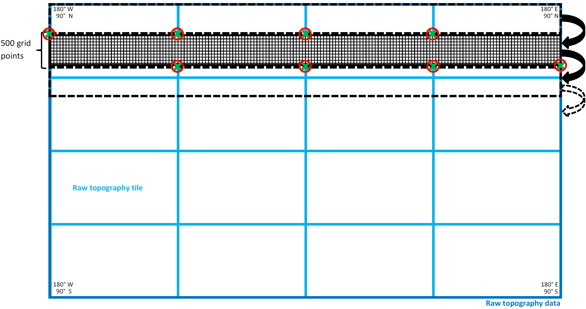

# Fortran Modules {#Fortran programmes}

## extpar_topo_to_buffer

### Short description

The program *extpar_topo_to_buffer* aggregates the orography of the
GLOBE, ASTER, or MERIT/REMA dataset to the target grid.

#### Target grid definition

The first part of this program contains several routines that read the
namelists defined in the run script (see 
[chapter 6](./user_manual_06_namelist_input.md#namelist_input_for_extpar)
for more information on the run
scripts). The first routine (init_target_grid) collects all the
information needed to define the target grid with an integrated routine
that gathers the variables given in the namelist `INPUT_grid_org`. The
variable igrid_type, which can either be 1 ('ICON') or 2 ('COSMO'), is
an integer switch to define the target grid.

Then a routine reads the namelist of the corresponding grid, which is
either `INPUT_ICON_GRID` or `INPUT_COSMO_GRID`, depending on the
chosen grid type. The run script contains only one of the two namelists.
This must be manually changed by the user. These namelists contain among
other variables the resolution of the grid, the user specified domain
and the location of the center of the grid (for closer information about
the namelists compare chapters
[6.2.2](./user_manual_06_namelist_input.md#namelist_input_for_extpar_grid_def_icon) -
[6.2.3](./user_manual_06_namelist_input.md#namelist_input_for_extpar_grid_def_cosmo)). 
This allows an exact definition of the target grid.

#### Subgrid-scale slope

The namelist INPUT_ORO contains the parameter lcompute_sgsl, to
determine whether SGSL should be calculated from the respective raw
topography data. Formerly this was done in a separate executable
extpar_sgsl_to_buffer.exe. From Release 5.3 onwards, the SGSL
calculation was incorporated into the execututable
'extpar_topo_to_buffer`. As an intermediate step, the SGSL is written
out to NetCDF, one separate file for each raw topography tile is
required. In case the preprocessed SGSL NetCDF are already available,
setting the parameter lpreproc oro= .false., deactivates the
preprocessing, but not the aggregation of SGSL to the target grid. We
recommend to only do the preprocessing for the GLOBE dataset, because
the computational cost for the ASTER or MERIT/REMA dataset is very high
and no validation has taken place for this dataset.

#### Topographic correction for radiation

In a second step, the namelist `INPUT_RADTOPO` is read. It contains the
information if the user desires the calculation of the topographical
corrected radiation parameters or not. If the switch is set to .TRUE. a
border is added to the COSMO domain, as the computations need grid
points beyond the edges of the normal domain. For ICON an on the fly
extension of the grid is not possible, leading to missing data at the
boundaries. Therefore the namelist-switch *max_missing* defines the
treshold for the allowed fraction of missingness. Altough the
topographical corrected radiation can be calculated for both ICON and
COSMO grids, the two sets of fields cannot be considered as identical,
because for ICON grids one assumes plain (non-tilted) grid-cells,
whereas for COSMO one also takes into account self-shading and effects
related to tilted-plains for the skyview-factor.

The number of horizons is specified in the namelist. For the COSMO-7 and
COSMO-2 setup 24 horizons are recommended. The icon-only parameter
*radius* defines the radial distance taken into account for the
topographical corrected radiation parameters. To account for the
anisotropic behaviour of longwave-radiation, the namelist parameter
*itype_scaling* defines the power of the term *SIN(horizon-angle)* in
the equation of the skyview-factor. Due to performance reasons, for ICON
the parameter *min_circ_cov* determines how many grid-cells can be
skipped on the circumference considered for the computations.

### Raw topography data

The namelist `INPUT_ORO` gives the possibility to switch between two
raw orographical data sets (GLOBE, ASTER, or MERIT/REMA). In contrast to
the 90m-data of MERIT/REMA, it must be considered, that the 30m-data of
ASTER are not completely downloaded and are therefore not globally
available. The downloaded region extends from 60N to 60S and from 180W
to 180E. It is not recommended to derive the topographical parameters
from ASTER if the region is beyond 60 degrees north or south. The ASTER
files are arranged as displayed in
[Figure 2](#fig:ASTER_files). As the computational time of the program
*extpar_topo_to_buffer* depends mainly on the number of ASTER files
that are read in, two new parameters are introduced in the namelist.
These two parameters give the number of columns and rows of the used
ASTER files. The filenames of the desired ASTER files must be given
manually. [Figure 2](#fig:ASTER_files) gives an example on how to use these
parameters in the case of COSMO-2. A similar approach is used for
MERIT/REMA DEM as shown in [Figure 3](#fig:map_merit_rema).
The latitude range between 60-90 deg S
is covered by REMA DEM, which was mapped to the MERIT data format by
BKG, Germany. If GLOBE is used the columns and rows are set to 4 and all
GLOBE files must be listed in the *topo_files* parameter. A check in
the program *extpar_topo_to_buffer* is introduced, which gives a
warning if the borders of the domain are exceeded. This is followed by
an abortion of this program. As there is no need to calculate the
subgrid scale parameters (SSO) for high resolution setups, there is the
logical switch *lsso_parm* to turn off the calculation of the SSOs.

*Figure 2: Illustration of the single domains of the 240 ASTER tiles.
An example of how the three parameters ntiles_columns, ntiles_row
and topo_files in the namelist could look like is given in red.*

*Figure 3: Illustration of the single domains of the 60 MERIT and the 12 REMA
tiles below 60 deg S latitude.*

Furthermore the variables of the namelist `INPUT_ORO`, which cover all
the raw topographical data information, are fed into the program. In
this namelist the path of the raw data is given as well as the names of
the topography data files. An integer switch allows the choice between
the highly resolved, non-global topography ASTER, the global but coarser
MERIT/REMA and the coarser and global data set GLOBE (1: GLOBE, 2:
ASTER, 3: MERIT/REMA). Furthermore the logical switch to decide whether
the SSO parameters are desired or not is read. In order to define the
right number of raw data tiles the variables ntiles_column and
ntiles_row must be available in the namelist. Additionally, the names
for the buffer and output files are defined.

The topography data files must be manually changed in the run script,
when switching from GLOBE to ASTER, or MERIT/REMA and vice versa.

Then, the number of tiles of the raw topography data is defined (this
varies between the raw data sets: 16 tiles for GLOBE, 1 - 240 tiles for
ASTER, 72 tiles for MERIT/REMA). This value is the product of the number
of tiles in each column and each row. The variables concerning the raw
topography are allocated and in a further step filled with the according
values. These values are the edges of each raw topography tile, the
number of gridpoints in x- and y-direction, as well as the resolution in
both directions. These are directly deduced from the raw data NetCDF
files. Finally the borders of the ASTER domain are defined, when ASTER
is used.

After the definition of the target grid and the topography set, a check
examines the compatibility of the user specified input with the target
grid; as ASTER is not globally available at the moment it is checked
that the user specified domain is contained in the current ASTER domain.
And, if this is not the case, the *extpar_topo_to_buffer* is aborted
with an error message.

#### Scale separation input

The namelist `INPUT_SCALE_SEP` gives all the information needed to
calculate the SSO parameters and roughness length based on a 3 km
filtered topography. Thus the logical switch `lscale_separation` must be
read to decide if a scale separation is desired or not. Furthermore the
raw data files and path must be provided. Note that the
`lscale_separation` can only be set to .TRUE. if GLOBE is used as
topography, as there is no ASTER or MERIT/REMA based 3 km filtered
topography available yet. Additionally the user must decide if the
computation of the SSO parameters make sense or not. 
[Table 3](#tab:scale_separation) can give some assistance to come to
the right decision.

 | **Resolution**                       | **Calculation of standard deviation**                                                | **`lscale_separation`**                      |
|--------------------------------------|--------------------------------------------------------------------------------------|--------------------------------------------|
| Model resolution is **smaller** than raw data resolution | SSOs: $\sigma = 0$, z0: $\hspace{12pt}\sigma = 0$ | .FALSE.  |
| Model resolution is **greater** than the raw data resolution but **smaller** than 3 km | SSOs: $\sigma = 0$, z0: $\hspace{12pt}\sigma = \sum {(model - raw\hspace{2pt} data)}^{2}$ | .FALSE. and lsso_param = .FALSE. |
| Model resolution is **greater** than 3 km | SSOs: $\sigma = \sum {(model - 3km\hspace{2pt} filt )}^{2}$, z0: $\hspace{12pt}\sigma = \sum {(3km\hspace{2pt} filt - raw\hspace{2pt} data)}^{2}$ | .TRUE.  |

*Table 3: Recommendations on the usage of the scale separation. Be aware that
the actual model topography resolution is approximately twice as large
as the model resolution. E.g. COSMO-2: The resolution of the
topography is approximately 4 km.*

#### Orographical smoothing input

The last namelist that must be read before allocating the orography is
the namelist `INPUT_OROSMOOTH`, which defines all the variables needed
to perform an orographical smoothing. The lfilter_oro logical switch,
controls the computation of the smoothing in EXTPAR.

#### Aggregation of the raw topography to the target grid

The subroutine *det_topo_tiles_grid* defines the grid of each raw
topography data tile. For this, the start and end latitude and longitude
of each tile, the distance between two grid points in the latitudinal
and longitudinal direction (dlat, dlon) as well as the number of grid
points in both directions (nlat, nlon) are derived for each tile.
Additionally, the grid for the whole GLOBE, ASTER, or MERIT/REMA domain
is derived; This is done in the subroutine *det_topo_grid*.

Before the raw topography can be aggregated on the target grid, the
target variables must be allocated. These variables include the land
fraction (FR_LAND), the elevation of the surface (hh_target), the
standard deviation of the elevation (stdh_topo), the roughness length
of the topography (z0_topo), the sub-grid scale orography parameters
(theta_topo, aniso_topo and slope_topo) and the topographical
corrected radiation parameters (slope_asp, slope_ang, horizon and
skyview). For the ICON grid some additional parameters must also be
allocated.

*The following paragraphs describe computations on the raw data grid.*

The subroutine *agg_topo_data_to_target_grid* does the actual work
of aggregating the raw topography to the target grid. The whole
topographical data set is divided in bands of 500 grid points in the
latitudinal direction and the whole range of the raw data domain in the
longitudinal direction (compare for this the black band in 
[Fig. 4](#fig:grid_figure)). This band is introduced to optimize
memory usage, as it is not possible to read the whole raw data in one
pass. In order to read the correct raw data the start and end index of
each tile (green crosses in 
[Fig. 4](#fig:grid_figure)) is defined. These indices are additionally
associated with a start and end index (red circles in 
[Fig. 4](#fig:grid_figure)) inside the band. The definition of the two
kinds of indices is performed by the routine
*get_topo_tile_block_indices*. With this band the whole raw data is
read step by step as suggested in 
[Fig. 4](#fig:grid_figure). If the scale separation is desired the
same procedure is applied to the 3 km filtered topography.

*Figure 4: Schematic illustration of the filling of the raw data with a 500 grid points long band. The green crosses indicate the start end end latitudes and longitudes of each raw topography tile (light blue tiles), whereas the red circles show the indices inside the band, where the green indices of the tiles must be placed.*

After this step, a temporary variable of elevation values is filled.
This variable consists of three rows, which comprises the whole
longitude range of the raw topography data. This is used to deduce the
gradients of the topography, which are calculated as averaged
differences between one eastern and one western grid point (x-gradient)
or with one northern and one southern grid point (y-gradient). From
these gradients in x- and y- direction also the squared gradients and
the dx$\ast$dy are computed.

This is followed by a call of the subroutine
*find_rotated_lonlat_grid_element_index*. This routine defines to
which grid element of the target grid a certain grid element of the raw
topography belongs. The allocation of the raw data points to the target
grid element is performed as shown in
[Fig. 5](#fig:aggregation_figure) a). All raw data elements that are
closer than half a grid point (green box) to the target point (red
circle) are used to define the value at the corresponding target grid
point. Only the green grid elements in
[Fig. 5](#fig:aggregation_figure) b) belong to a target grid element.
The rest of the raw topography is unused.

*Figure 5: a) Illustration of the aggregation of the raw data to the target grid. The red circle indicates a target grid point, while the green rectangle represents the part of the raw data that is aggregated on the target grid point. b) Showing the target grid on top of the raw data set, where only the green grid points of the raw data are used for the target grid.*

The elevations of raw data pixels that belong to one target grid element
are summed up, and the number of raw data pixels contributing to one
target grid element is tracked. A summation of the raw data values for
each target grid element is also performed for the squared elevation,
which is later used for the standard deviation, and for the gradients
calculated before, which are required for the computation of the subgrid
scale orography parameters. The latter is only calculated if the SSO
parameters are desired. When making use of the scale separation the
squared differences between the original and the 3 km filtered
topography must be computed at every grid point. This is needed in order
to calculate the roughness length specific standard deviation. After
these calculations, the temporary rows are shifted to the north and the
computation is repeated for the next center line. As soon as a band of
500 rows is finished a new one will be read in.

Now that all auxiliary variables are available, all loops over the raw
topography data are closed and a new one over all the grid points of the
target grid is opened.

*The following paragraphs describe computations on the target grid.*

First of all the elevation is calculated as the mean of all the raw
topography data points that are enclosed in one target grid point.

As soon as the topography is available on the target grid, the
orographical smoothing is applied using the subroutine *do_orosmooth*.

In a next step the variance and the standard deviation of the elevation
at each target grid point is estimated. Subsequently, the SSO parameters
angle of principle axis, anisotropy factor and slope parameter are
calculated according to Lott and Miller (1996). These SSOs are only
calculated if the SSO switch is set to .TRUE. and if the standard
deviation of the height is more than 10 meters, as the trivial case of
the ocean is tried to be avoided. If the scale separation is switched on
the SSOs are based on the 3 km filtered topography. Finally the
orographical roughness length is calculated using the standard
deviation, but only if at least one raw data pixel is present in the
target grid element.

In the case where no raw topography data pixel is available in a target
grid, a weighted bilinear interpolation between neighboring raw data
grid element is performed to obtain an elevation in all target grid
points. This mainly happens if the raw topography has a similar
resolution as the target grid. If the bilinear interpolation needs to be
applied, all the SSO as well as z0 are set to zero for this grid
element. With this step the end of the subroutine
*agg_topo_data_to_target_grid* is reached.

In the program *extpar_topo_to_buffer* an additional check on SSOs
and z0 is performed. If none of the elements of the target grid is
associated with at least ten raw data pixels, or as soon as one single
element is not associated with any raw data pixel, all the SSOs and z0
are set to zero.

As soon as there is a value for all the target grid elements, the
calculation for the topographical corrected radiation parameters can
start, if desired at all.

Finally NetCDF files for the orography based external parameters are
created, where different NetCDF routines are used for each grid type, as
different parameters are needed for each of them. If the lradtopo is set
to .TRUE. the enlarged domain is cut back to the user specified domain,
before writing it to the NetCDF file.

### Used namelist files and data in-/output

-   namelist files: INPUT_grid_org, INPUT_COSMO_GRID,
    INPUT_ICON_GRID,
    INPUT_ORO, INPUT_OROSMOOTH, INPUT_RADTOPO

-   data input (GLOBE): GLOBE_A10.nc - GLOBE_P10.nc

-   data input (ASTER): ASTER_T001.nc - ASTER_T240.nc

-   data input (MERIT/REMA): MERIT_N90-N60_E150-E180.nc4 -
    REMA_BKG_S60-S90_W180-W150.nc4

-   data input (filtered): GLOBE_A_filt_lanczos_window.nc -
    GLOBE_P_filt_lanczos_window.nc,
    GLOBE_A_filt_tukey_0.75_3.0_it4.nc -
    GLOBE_P_filt_tukey_0.75_3.0_it4.nc

-   Output: buffer file with orography data (/orography_io_extpar/
    orography_buffer_file)
    output file with orography data (used in extpar_cru_to_buffer)
    (/orography_io_extpar/ orography_output_file)

## extpar_landuse_to_buffer

### Short description

The executable *extpar_landuse_to_buffer* aggregates the land use
data to the target grid. Five different raw datasets can be processed:
Globcover, GLC2000, GLCC, ESA CCI-LC and Ecoclimap Second Generation
(Ecoclimap-SG from here onwards). As GLC2000 and Globcover do not
include Antarctica, GLCC or ESA CCI-LC data can be used for the missing
areas. The landuse executable also includes the TERRA-URB module,
controlled by the logical switch *l_terra_urb*; see section
[3.2.2](#terra_urb) for details.

##### Target grid definition

The definition of the target grid is done by reading the namelist
`INPUT_grid_org`. This namelist contains the information about the
grid type, which can either be ICON or COSMO. With the information about
the grid type, the namelist containing the grid definition can be read.
The name of the namelist must be changed manually by the user, according
to the chosen grid type. The namelist must either be `INPUT_ICON` or
`INPUT_COSMO`. For a more exact description of the target grid
definition, read the subsection *'Target grid definition'* in section
[3.1](#extpar_topo_to_buffer). After specifying the grid definition
the southern band of the target grid is defined. This information is
important, as the two raw data sets GLC2000 and Globcover do not cover
the region below 60 degrees south. If this region is desired by the
user, the third data set must be considered for the domain below the
southern band. Additionally the target fields for the land use data are
allocated.

#### Raw landuse data

In a next step the namelist `INPUT_LU` is read. It contains an integer
switch (*i_landuse_data*) that gives the possibility to choose between
the five different raw data sets e.g., 1 (Globcover), 2 (GLC2000), 3
(GLCC), 5 (ESA CCI-LC), and 6 (Ecoclimap-SG). For Globcover one can
additionally choose to use the corine landuse dataset by setting the
logical switch (*l_use_corine*) to TRUE. Furthermore the path and the
filename of the desired raw data and of GLCC are specified there. The
user must adjust the filename and path manually according to the chosen
raw data in *i_landuse_data*. In addition the name of the desired
lookup table is read, which again can be chosen by the user using an
integer switch *ilookup_table_lu*. The lookup tables are described in
more detail in [Table 5](#tab:look_up_table). The names of the buffer files for the
target landuse fields and for the target GLCC fields are also specified
in this namelist. Finally, the aforementioned *l_terra_urb* logical
switch can be specified (the default value is .FALSE.).

After having read the namelists, the number of tiles of the raw data set
is defined. The number of tiles is set to 1 as default and must only be
changed for the raw data set Globcover or ESA CCI-LC, which are composed
of 6 tiles. The basic information of the Globcover tiles, such as the
latitude and longitude edges and the resolution is allocated according
to the number of tiles. Later these variables are filled with the
respective information, read from the NetCDF files directly.

*For the remaining procedures the three different raw land use data have
their separate routines, which are constructed identically.*

The allocation of the data is done using the number of grid points in
the latitudinal and longitudinal direction. Furthermore the land-use
target fields are allocated using the target grid for the dimension size
and the number of land-use classes. The land-use classes differ for the
three raw data sets and are described in more detail in
[Table 4](#tab:land_use_classes).

| **Data Set**                                                  | **Number of Class** | **Name of Class**                                                    |
|---------------------------------------------------------------|---------------------|----------------------------------------------------------------------|
| **(Total number of Classes)**                            |                     |                                                       |
| **GLOBCOVER (23)**                                       |                     |                                                 |
|                                                               | 01                  | irrigated croplands                                   |
|                                                               | 02                  | rainfed croplands                                     |
|                                                               | 03                  | mosaic cropland (50-70%) - vegetation (20-50%)      |
|                                                               | 04                  | mosaic vegetation (50-70%) - cropland (20-50%)      |
|                                                               | 05                  | closed broadleaved evergreen forest                   |
|                                                               | 06                  | closed broadleaved deciduous forest                   |
|                                                               | 07                  | open broadleaved deciduous forest                     |
|                                                               | 08                  | closed needleleaved evergreen forest                  |
|                                                               | 09                  | open needleleaved decid. or evergr. forest            |
|                                                               | 10                  | mixed broadleaved and needleleaved forest             |
|                                                               | 11                  | mosaic shrubland (50-70%) - grassland (20-50%)      |
|                                                               | 12                  | mosaic grassland (50-70%) - shrubland (20-50%)      |
|                                                               | 13                  | closed to open shrubland                              |
|                                                               | 14                  | closed to open herbaceous vegetation                  |
|                                                               | 15                  | sparse vegetation                                     |
|                                                               | 16                  | closed to open forest regulary flooded                |
|                                                               | 17                  | closed forest or shrubland permanently flooded        |
|                                                               | 18                  | closed to open grassland regularly flooded            |
|                                                               | 19                  | artificial surfaces                                   |
|                                                               | 20                  | bare areas                                            |
|                                                               | 21                  | water bodies                                          |
|                                                               | 22                  | permanent snow and ice                                |
|                                                               | 23                  | undefined                                       |
| **Corine (23)**                                          |                     |                                                 |
| **Corine (23)**                                          |                     |                                                 |
| (CLC: 2.1.2, 2.1.3)                                           | 11                  | irrigated croplands                                   |
| (CLC: 2.1.1)                                                  | 14                  | rainfed croplands                                     |
| (CLC: 2.4.2, 2.4.3)                                           | 20                  | mosaic cropland (50-70%) - vegetation (20-50%)     |
| (CLC: 2.4.4)                                                  | 30                  | mosaic vegetation (50-70%) - cropland (20-50%)      |
|                                                               | 40                  | closed broadleaved evergreen forest                   |
| (CLC: 3.1.1)                                                  | 50                  | closed broadleaved deciduous forest                   |
|                                                               | 60                  | open broadleaved deciduous forest                     |
| (CLC: 3.1.2)                                                  | 70                  | closed needleleaved evergreen forest                  |
| (CLC: 1.4.1)                                                  | 90                  | open needleleaved decid. or evergr. forest            |
| (CLC: 3.1.3)                                                  | 100                 | mixed broadleaved and needleleaved forest             |
| (CLC: 2.2.3, 3.2.4)                                           | 110                 | mosaic shrubland (50-70%) - grassland (20-50%)      |
| (CLC: 2.2.2, 3.2.2)                                           | 120                 | mosaic grassland (50-70%) - shrubland (20-50%)      |
| (CLC: 2.2.1)                                                  | 130                 | closed to open shrubland                              |
| (CLC: 2.3.1, 3.2.3)                                           | 140                 | closed to open herbaceous vegetation                  |
| (CLC: 3.2.1)                                                  | 150                 | sparse vegetation                                     |
|                                                               | 160                 | closed to open forest regulary flooded                |
| (CLC: 4.1.2)                                                  | 170                 | closed forest or shrubland permanently flooded        |
| (CLC: 4.1.1)                                                  | 180                 | closed to open grassland regularly flooded            |
| (CLC: 1.1.1, 1.1.2, 1.2.1, 1.2.2, 1.2.3, 1.2.4, 1.3.3, 1.4.2) | 190                 | artificial surfaces                                   |
| (CLC: 3.3.1, 3.3.2, 3.3.3, 3.3.4, 1.3.1, 1.3.2)               | 200                 | bare areas                                            |
| (CLC: 4.2.1, 4.2.2, 4.2.3, 5.1.1, 5.1.2, 5.2.1, 5.2.2, 5.2.3) | 210                 | water bodies                                          |
| (CLC: 3.3.5)                                                  | 220                 | permanent snow and ice                                |
| (CLC: 9.9.9)                                                  | 230                 | undefined                                       |
| **GLC2000 (23)**                                         |                     |                                                 |
|                                                               | 01                  | evergreen broadleaf tree                              |
|                                                               | 02                  | deciduous broadleaf tree closed                       |
|                                                               | 03                  | deciduous broadleaf tree open                         |
|                                                               | 04                  | evergreen needleleaf tree                             |
|                                                               | 05                  | deciduous needleleaf tree                             |
|                                                               | 06                  | mixed leaf tree                                       |
|                                                               | 07                  | fresh water flooded tree                              |
|                                                               | 08                  | saline water flooded tree                             |
|                                                               | 09                  | mosaic tree / other natural vegetation                |
|                                                               | 10                  | burnt tree cover                                      |
|                                                               | 11                  | evergreen shrubs closed-open                          |
|                                                               | 12                  | deciduous shrubs closed-open                          |
|                                                               | 13                  | herbaceous cover closed-open                          |
|                                                               | 14                  | sparse herbaceous or grass                            |
|                                                               | 15                  | flooded shrub or herbaceous                           |
|                                                               | 16                  | cultivated and managed areas                          |
|                                                               | 17                  | mosaic crop/tree/natural vegetation                   |
|                                                               | 18                  | mosaic crop/shrub or grass                            |
|                                                               | 19                  | bare areas                                            |
|                                                               | 20                  | water bodies                                          |
|                                                               | 21                  | snow and ice                                          |
|                                                               | 22                  | artificial surfaces                                   |
|                                                               | 23                  | undefined                                       |
| **GLCC (24)**                                            |                     |                                                 |
|                                                               | 01                  | urban and built-up land                               |
|                                                               | 02                  | dryland cropland and pasture                          |
|                                                               | 03                  | irrigated cropland and pasture                        |
|                                                               | 04                  | mixed dryland/irrigated                               |
|                                                               | 05                  | cropland/grassland mosaic                             |
|                                                               | 06                  | cropland/woodland mosaic                              |
|                                                               | 07                  | grassland                                             |
|                                                               | 08                  | shrubland                                             |
|                                                               | 09                  | mixed shrubland/grassland                             |
|                                                               | 10                  | savanna                                               |
|                                                               | 11                  | decidous broadleaf forest                             |
|                                                               | 12                  | decidous needleleaf forest                            |
|                                                               | 13                  | evergreen broadleaf forest                            |
|                                                               | 14                  | evergreen needleleaf forest                           |
|                                                               | 15                  | mixed forest                                          |
|                                                               | 16                  | water bodies                                          |
|                                                               | 17                  | herbaceous wetland                                    |
|                                                               | 18                  | wooded wetland                                        |
|                                                               | 19                  | barren or sparsely vegetated                          |
|                                                               | 20                  | herbaceous tundra                                     |
|                                                               | 21                  | wooded tundra                                         |
|                                                               | 22                  | mixed tundra                                          |
|                                                               | 23                  | bare ground tundra                                    |
|                                                               | 24                  | snow or ice                                     |
| **Ecoclimap-SG (33)**                                    |                     |                                                 |
|                                                               | 01                  | sea and oceans                                        |
|                                                               | 02                  | lakes                                                 |
|                                                               | 03                  | rivers                                                |
|                                                               | 04                  | bare land                                             |
|                                                               | 05                  | bare rock                                             |
|                                                               | 06                  | permanent snow                                        |
|                                                               | 07                  | boreal broadleaf deciduous                            |
|                                                               | 08                  | temperate broadleaf deciduous                         |
|                                                               | 09                  | tropical broadleaf deciduous                          |
|                                                               | 10                  | temperate broadleaf evergreen                         |
|                                                               | 11                  | tropical broadleaf evergreen                          |
|                                                               | 12                  | boreal needleleaf evergreen                           |
|                                                               | 13                  | temperate needleleaf evergreen                        |
|                                                               | 14                  | boreal needleleaf deciduous                           |
|                                                               | 15                  | shrubs                                                |
|                                                               | 16                  | boreal grassland                                      |
|                                                               | 17                  | temperate grassland                                   |
|                                                               | 18                  | tropical grassland                                    |
|                                                               | 19                  | winter C3 crops (lower T)                                            |
|                                                               | 20                  | summer C3 crops                                       |
|                                                               | 21                  | C4 crops (warmer environments)                        |
|                                                               | 22                  | flooded trees                                         |
|                                                               | 23                  | flooded grassland                                     |
|                                                               | 24                  | LCZ1: compact high-rise                               |
|                                                               | 25                  | LCZ2: compact midrise                                 |
|                                                               | 26                  | LCZ3: compact low-rise                                |
|                                                               | 27                  | LCZ4: open high-rise                                  |
|                                                               | 28                  | LCZ5: open midrise                                    |
|                                                               | 29                  | LCZ6: open low-rise                                   |
|                                                               | 30                  | LCZ7: lightweight low-rise                            |
|                                                               | 31                  | LCZ8: large low-rise                                  |
|                                                               | 32                  | LCZ9: sparsely built                                  |
|                                                               | 33                  | LCZ10: heavy industry                                 |

*Table 4: Land-use classes for the different raw data sets. The Corine
  LandCover (CLC) classes in the left column indicate how the CLC is
  mapped to the corresponding GlobCover class.*

After the allocation of the data a check is performed to query, if the
user desires a domain that goes beyond the southern bound of the raw
data. If it is the case, the GLCC target fields are allocated as well.

In case that Globcover is used, the grid for the single tiles must be
defined as well.

#### Aggregation of the raw land-use data to the target field

The definition and allocation part is done and the most important part,
the aggregation of the raw data to the target grid can be performed. In
order to be able to aggregate the data, the lookup table must first be
initialized. The initial values differ for the various settings listed
in [Table 5](#tab:look_up_table). Also the name of the lookup table must
be defined using the integer numbers specified in the namelist
`INPUT_LU`. The integer number are listed together with their
associated lookup table names in
[Table 5](#tab:look_up_table).

**Raw Data**   | **Integer** | **Setting**                                                   | **Name of the lookup table**
-------------- | ----------- | ------------------------------------------------------------- | ------------------------------
GLOBCOVER      | 1           | operational settings                                          | Asensio, 2011
               | 2           | experimental settings, analog to lookup tables of ECOCLIMAP   | Asensio, 2010
GLC2000        | 1           | operational settings of GME                                   | Ritter, 2007
               | 2           | operational settings of COSMO                                 | Heise, 2005
               | 3           | experimental settings, analog to lookup tables of ECOCLIMAP   | Asensio, 2010
GLCC           | 1           | operational settings of GME                                   | Ritter, 2007
               | 2           | operational settings of COSMO                                 | Heise, 2005
               | 3           | experimental settings, analog to lookup tables of ECOCLIMAP   | Asensio, 2010
ESA CCI-LC     | 1           | experimental settings                                         | Helmert, 2019
Ecoclimap-SG   | 1           | Globcover analogue with added LCZs from Oke                   |            
                                                                                             
*Table 5: Names of the lookup tables and the different possible settings for
each raw land-use data set.*

*The following paragraphs describe computations on the raw data grid.*

For GLC2000 and GLCC, the raw data is read in lines of a complete
longitude going from 180 degrees east to 180 degrees west, through a
loop over the latitude. Before any calculation is performed, it is
tested if the value of the latitude is contained inside the targed
domain. In case it is not, the loop is cycled. Reading of the data
line-wise can be done from the NetCDF file directly.

Using the routine *find_nearest_target_grid_element* each raw data
pixel is assigned to a target grid point. A more precise description and
a figure that describes the procedure can be found in paragraph
*'Aggregation of the raw topography to the target grid'* and in
[Fig. 5](#fig:aggregation_figure) in section
[3.1](#extpar_topo_to_buffer).

As Globcover and ESA CCI-LC are composed of six tiles, the reading of
the raw data must be performed in a different way than for the other
three data sets. The reading of the data for Globcover is done in the
same way as for the topography. Compare the paragraph *'Aggregation of
the raw topography to the target grid'* in section
[3.1](#extpar_topo_to_buffer). As there is no need to calculate
gradients for the land use, the corresponding variable, which contains
three lines of raw data, is not used.

The lookup table is then fed with the land use class, which gives a
value for all the target fields listed in
[Table 6](#tab:target_fields_lu).

**Variable long name**         | **Variable short name**   
------------------------------ | ------------------------- 
Fraction Land                  | FR_LAND                   
Ice fraction                   | FR_ICE                    
Plant cover maximum            | PLCOV_MX                  
Plant cover minimum            | PLCOV_MN                  
Leaf area index maximum        | LAI_MX                    
Leaf area index minimum        | LAI_MN                    
Minimal stomata resistance     | RS_MIN                    
Urban area fraction            | URBAN                     
Fraction of deciduous forest   | FOR_D                     
Fraction of evergreen forest   | FOR_E                     
Longwave surface emissivity    | EMISS_RAD                 
Root depth                     | ROOTDP                    
Roughness length               | Z0                       
                                                           
*Table 6: The variables that are computed using the raw land-use data.*

The number of grid points that fall into the same target grid and land
use class are summed up. The values of the target fields are weighted
with the whole pixel area and summed up. Except for the emissivity,
which is the only land-use parameter that also has valid values over
water, only land pixels are considered. Values that depend on the plant
cover, such as PLCOV_MX, PLCOV_MN, LAI_MN, LAI_MX, RS_MIN, FOR_E,
FOR_D, ROOTDP and z0, are weighted **with the plant cover maximum** in
addition to the pixel area.

*The following paragraphs describe computations on the target grid.*

The total area and the land area of each target grid point is first
defined. Then the weighted sums of the target fields derived in the
previous step are normalized to obtain the definite values. The
emissivity and the number of land use classes are normalized by the
total area to obtain the correct emissivity and area fraction of each
land use class. The other parameters are only considered if the
area_land is larger than zero: FR_LAND and FR_ICE are normalized with
the total area, URBAN, FOR_D, FOR_E, PLCOV_MN and PLCOV_MX are
normalized by the land area, the ROOTDP, LAI_MN, LAI_MX and RS_MIN
are normalized by the area covered by plants. If only sea pixels are
found, all the fields are undefined.

Finally land-use classes are defined for target grid points that do not
contain any raw data pixel. In contrary to the topography, where a
bilinear interpolation is performed, here the nearest neighbor is
searched. The associated land use class is used with the lookup tables,
and the target fields are defined.

The target fields are written to a NetCDF buffer file, which can later
be used for the consistency check. There is a file for the chosen land
use data set, and one, if needed at all, for the GLCC land use data.
Finally the allocated memory is deallocated again.

### TERRA-URB {#terra_urb}

**NOTE**: *currently the TERRA-URB module in EXTPAR only works with the
Ecoclimap-SG database*, as this is the only database available for
extpar with an LCZ map.

The executable *extpar_landuse_to_buffer* also includes the TERRA-URB
module, controlled by the logical switch *l_terra_urb*. This module
uses a 2D map of local climate zones (LCZ) to determine a set of urban
canopy variables used by TERRA-URB in COSMO/ICON, see 
[Table 7](#tab:terra_urb). The
module aggregates the variables and outputs them to the
lu_buffer_file. The aggregation procedure follows that of the other
land use variables described in the previous sections. The TERRA-URB
related variables then pass through the subprogram
*extpar_consistency_check* (see section
[3.7](#extpar_consistency_check)) and are written out to the final
extpar file for both COSMO and ICON. ICON would typically ignore these
fiels and just use the information from the LU_CLASS_FRACION field, as
is done for other land use variables, except for when *ntiles=1* in
which case it needs the 2D fields. The ISA and AHF EXTPAR modules must
be turned off when running with *l_terra_urb=.true*, as these fields
are computed within the TERRA-URB module. The code for this module is
based upon Matthias Demuzere's
[WUDAPT-to-COSMO :material-open-in-new:](https://github.com/matthiasdemuzere/WUDAPT-to-COSMO){:target="_blank"}
[@Varentsov2020] and Handrik Wouters'
[SURY :material-open-in-new:](https://github.com/hendrikwout/sury){:target="_blank"} [@Wouters2016] codes. The
LCZ look-up tables are based on the values published in
[@Stewart2012; @Stewart2014].

  **Variable name**   | **Description**
  ------------------- | -------------------------------------
  FR_URBAN            | Urban area fraction
  ISA                 | Impervious surface area
  AHF                 | Anthropogenic heat flux
  FR_PAVED            | Fraction of impervious surface area
  URB_FR_BLD          | Urban building fraction
  URB_H_BLD           | Urban building height
  URB_H2W             | Urban canyon height to width ratio
  URB_ALB_SO          | Urban shortwave (solar) albedo
  URB_ALB_TH          | Urban thermal albedo
  URB_EMIS            | Urban emissivity
  URB_HCON            | Urban mean heat conductivity
  URB_HCAP            | Urban mean heat capacity

*Table 7: Varialbes provided by the TERRA-URB module*

### Used namelist files and data in-/output

-   namelists files:
    - INPUT_grid_org
    - INPUT_COSMO_GRID
    - INPUT_ICON_GRID
    - INPUT_LU

-   data input:
    - GLC2000_byte.nc, GLCC_usgs_class_byte.nc
    - CORINE_globcover.nc
    - GLOBCOVER_0_16bit.nc - GLOBCOVER_5_16bit.nc
    - ECCI_300m_0.nc - ECCI_300m_5.nc
    - ECOCLIMAP_SG.nc

-   Output:
    - buffer file with landuse data (/lu_io_extpar/ lu_buffer_file)
    - buffer file with GLCC data (/glcc_io_extpar/ glcc_buffer_file)

## extpar_aot_to_buffer

### Short description

The executable *extpar_aot_to_buffer* aggregates aerosol optical
thickness data to the target grid.

#### Target grid definition

The definition of the target grid is again done using the namelist
`INPUT_grid_org`. As the subroutines are exactly the same as the ones
used in *extpar_topo_to_buffer*, it is referred to the subsection
*'Target grid definition'* in section
[3.1](#extpar_topo_to_buffer), where the procedure is explained in
more detail.

#### Raw aerosol optical depth data

The namelist `INPUT_AOT` is kept very simple. It contains only the path
and the name of the raw aerosol optical depth data. The integer switch
(*iaot_type*) informs EXTPAR which of the 2 available datasets has been
chosen: 1 (Tegen), 2 (AeroCom).
Additionally, also the filenames of the buffer and output files for the
aggregated data is specified.

In order to allocate the variables used to read the raw data, the
dimensions of the raw data is defined. These dimensions include the
number of rows and columns of the NetCDF raw data file, the number of
months, which is equal to 12, as a full yearly cycle is described, and
the number of types of aerosols contained in the raw data file. This
number is 5 for iaot_type=1 or 2 , as the raw data file contains the
aerosol optical thickness information of black carbon, dust, organic
matter, sulfate and sea salt. The 3 first data-sets which provide
raw data for different aerosol types refer to Tegen[^1] and AeroCom[^2]. 

In a next step, the complete raw data is read into memory; this is
possible since the aerosol optical depth raw data is of rather coarse
resolution (see [Table 8](#tab:aerosol)). Also, the grid of the raw data is determined
from NetCDF meta data. Before the aggregation to the target grid can
start, the target grid fields must be allocated, using the target grid,
the number of months and aerosol types or spectral bands.

**Raw data set**   | **resolution**
------------------ | --------------------------
Tegen              | 4 x 5 degree
AeroCom            | 1 x 1 degree

*Table 8: Resolution of raw data-sets for aerosol optical depths.*

#### Aggregation of the aerosol optical depth to the target field

As the resolution of all raw data sets is so coarse, there is no need to
go through the whole raw data set and find the corresponding target grid
element. Here there is only one loop over the target grid. For every
target grid element four surrounding raw data points are searched for.
With these four points, a weight for the bilinear interpolation is
computed. As the raw data grids of the 5 different aerosols are equal,
the four surrounding points are the same for all months and aerosol
types. Four new arrays (SW, SE, NE, NW) are then defined, which contain
the four neighbor values, for each month and each type. These can now be
used, together with the previously calculated weights, to calculate the
bilinear interpolation.

Finally the data is saved in a NetCDF buffer and an output file, and the
allocated variables are deallocated.

### Used namelist files and data in-/output

-   namelists files: INPUT_grid_org, INPUT_COSMO_GRID,
    INPUT_ICON_GRID, INPUT_AOT

-   data input: aot_GACP.nc, aod_AeroCom1.nc

-   Output: buffer file with aerosol data (/aerosol_io_extpar/
    aot_buffer_file)

## extpar_soil_to_buffer

### Short description

The executable *extpar_soil_to_buffer* aggregates soil data of the
FAO Digital Soil Map of the World or of the Harmonized World Soil Data
(HWSD) to the target grid.

#### Target grid definition

The definition of the target grid is again done using the namelist
`INPUT_grid_org`. As the subroutines are exactly the same as the ones
used in *extpar_topo_to_buffer*, it is referred to the subsection
*'Target grid definition'* in section
[3.1](#extpar_topo_to_buffer), where the procedure is explained in
more detail.

#### Raw soil data

The variables for the raw soil data are read from the namelist
`INPUT_SOIL`. These variables are the path and the names of the raw
data files and two switches to decide whether the FAO or the HWSD data
should be used. The integer
switch *isoil_data* determines the raw data and processing used: 1 for
FAO, 2 for the HWSD data-set[^6] and 3 for the use of HWSD data with
mapping to TERRA soil types. 
Additionally, the names of the buffer files are specified. Be aware that
a change of the integer switch from FAO to HWSD requires also the manual
replacement of the raw data file names in the namelist.

After reading the namelist, a check is made on the production of subsoil
characteristics. This is only supported for HWSD data, and a warning is
issued in case of bad usage.

The dimensions of the raw soil data are defined, which include the
number of grid points in the latitudinal and longitudinal direction, as
well as the number of soil data code of the raw data. These values are
needed to allocate the soil data with the proper size.

The mapping between raw data sets specific codes and some standard soil
types is defined; this concerns the soil types `undefined`, `default`,
`ice` and `water`.

As the soil data is provided in one single file, all data can be read in
one shot. The data that are read from the NetCDF file are the texture
and the slope of the soil data and the soil code. The aggregation of the
data is done in a different way for the FAO and HWSD data, as these
result in two completely different variables. Moreover, for HWSD data,
to conserve memory, the topsoil data are allocated first and aggregated
to the target grid, before the same is done for the subsoil.

#### Aggregation of the FAO and HWSD data with TERRA mapping to the target grid

*The following paragraphs describe computations on the raw data grid.*

The soil data is read using a loop over the latitude and the longitude.
This results in a point-wise reading of the raw data. As soon as the
point is read, its corresponding target grid element is defined. If the
regular latitude/longitude grid point is not contained in the target
grid, a new point is read. If however the point is inside the target
grid, the aggregation can begin.

The number of raw data pixels is increased by one, if a raw data point
can be assigned to a target grid point. This number is later used to
define the fraction land defined by the soil data. The corresponding
soil unit is deduced from the raw data. If the soil unit is zero, this
is an ocean pixel and the number of sea points is increased by one. If
the soil code differs from zero, the number of land points is increased
by one. The soil code is then associated to either a special or a normal
soiltype. For all the special soiltypes such as ice, rock, salt,
histosols, dunes and no data flags the respective texture (coarse,
medium, fine) are defined using a lookup table. All other soil units are
described using the texture available in the raw data. These values
define the final texture variable `texture`.

*The following paragraphs describe computations on the target grid.*

In the following a loop is opened over the target grid points. First of
all the fraction land is defined using the number of land pixels minus
the number of inland water pixels, which is then averaged by the number
of raw data pixels that were available for the target grid element. In a
next step the texture for every target grid element is defined. For the
special soiltypes (texture larger than 900) the corresponding number is
associated. For the normal soiltypes (texture smaller than 900) the
texture is calculated as average of the summed up texture. The resulting
texture value is multiplied by 100 and converted into an integer number.
This number is used to associate the final soiltype to every target grid
element. The soiltypes are described in more detail in table
[9](#tab:soil_types_FAO). For target grid points that do not
contain any raw data points, the nearest neighbor in the raw data is
defined. If the target grid point is outside the raw data grid the slope
is defined as zero and the texture as undefined.

**TERRA Code**   | **Soiltype**              | **raw data code**
---------------- | ------------------------- | ------------------------------------------------------------------
1                | **ice and glacier**[^7]   | 9001
2                | **rock, lithosols**       | 9002
3                | sand                      | 9003 (salt), 9005 (shifting sands and dunes) and coarse texture
4                | sandy loam                | coarse to medium texture
5                | loam (default soiltype)   | 9009 (undefined), 9012 (dominant part undefined), medium texture
6                | loamy clay                | medium to fine texture
7                | clay                      | fine texture
8                | **histosols (peat)**      | 9004
9                | **water**                 | 9000 (undefined: inland water), -9 (undefined: ocean)

*Table 9: TERRA soiltypes and their respective FAO raw data codes.* 

#### Aggregation of the HWSD data to the target grid

The aggregation starts again with a loop over the latitudes and
longitudes. For each grid point a target grid element is looked for. If
there is a target grid element, the aggregation can start. The soiltype
is defined using the raw data value, if it is above zero, and zero
otherwise. Additionally, all the ocean, land and lake points are counted
in order to determine the land fraction which is calculated as the
difference between the summed up land and lake points normalized by the
number of raw data pixels available. For target grid points with no raw
data, the nearest neighbor in the raw data is defined.

The resulting soiltype is not yet usable, as it contains numbers coded
in a world code and not in TERRA soiltypes. This transformation is done
in the consistency check, where the special soiltypes of the HWSD data,
specified in [Table 10](#tab:soil_types_HWSD), are packed in the variable `SOILTYP`
the normal soiltypes are given in fractions of sand, silt, clay and
organic carbon, and the bulk density is also given.

**TERRA Code**   | **Soiltype**              | **TERRA Code**   | **Soiltype**
---------------- | ------------------------- | ---------------- | ----------------------------
1                | **ice and glacier**       | 8                | **histosols (peat)**
2                | **rock, lithosols**       | 9                | **water**
3                | sand                      | 10               | **alkali flat**
4                | sandy loam                | 11               | **shifting sand, dunes**
5                | loam (default soiltype)   | 12               | **Urban, human disturbed**
6                | loamy clay                | 225              | **Unknown**
7                | clay                                     

*Table 10: New TERRA soiltypes deduced from the HWSD data.*

#### Output of the soil data

The soiltypes and the fraction land, together with the undefined value,
the latitudes and longitudes are saved in a NetCDF buffer file. This is
later used to perform the consistency check, which is especially
important for the HWSD data, as the main transformation of the data
takes place there.

### Used namelist files and data in-/output

-   namelists files: INPUT_grid_org, INPUT_COSMO_GRID,
    INPUT_ICON_GRID, INPUT_SOIL

-   data input: FAO_DSMW_double.nc, FAO_DSMW_float.nc,
    HWSD0_30_topsoil.nc, HWSD30_100_subsoil.nc

-   Lookup tables for HWSD: LU_TAB_HWSD_UF.data,
    HWSD_DATA_COSMO.data,
    HWSD_DATA_COSMO_S.data

-   Output: buffer file with soil data (/soil_io_extpar/
    soil_buffer_file)

## extpar_flake_to_buffer

### Short description

The executable *extpar_flake_to_buffer* aggregates lake depth data
and lake fraction to the target grid.

#### Target grid definition

The definition of the target grid is again done using the namelist
`INPUT_grid_org`. As the subroutines are exactly the same as the ones
used in *extpar_topo_to_buffer*, it is referred to the subsection
*'Target grid definition'* in section
[3.1](#extpar_topo_to_buffer), where the procedure is explained in
more detail.

#### Raw lake data

As only the target grid dimensions are needed to allocate the target
fields, this is done right after the definition of the target grid. Then
the namelist `INPUT_FLAKE` is read to define the path and the filename
of the raw lake data. Also the names of the buffer and the output file
for the consistency check are given. Once more the dimensions of the raw
data are needed to allocate the raw data correctly; these dimensions are
deduced from the netcdf file directly and the raw data grid is defined.

#### Aggregation of the lake data to the target grid

*The following paragraphs describe computations on the raw data grid.*

The data is read row-wise, through a loop over the latitudes, shipping
all latitudes not inside the user specified domain. If a row is kept, a
new loop over the longitudes is started to treat the raw data
point-wise. For each point, the corresponding target field element is
defined. This is done in the same way described in the subsection
*'Aggregation of the topography to the target grid'* in section
[3.1](#extpar_topo_to_buffer) and
[Fig. 5](#fig:aggregation_figure). The number of raw data pixels that
contribute to the target grid value are summed up as well as the lake
depth, which is multiplied by a scale factor deduced from the area of
each pixel that contributes to a lake fraction.

*The following paragraphs describe computations on the raw data grid.*

The lake fraction is derived and the lake depth is obtained by
normalizing the weighted sum previously computed. Where no lake depth is
available the value is set to undefined (-1). In case that no raw data
pixel is available the nearest neighbor in the raw data is searched for.

The target fields are then written to a netcdf buffer and output file.
Finally the allocated memory can be released.

### Used namelist files and data in-/output

-   namelists files: INPUT_grid_org, INPUT_COSMO_GRID,
    INPUT_ICON_GRID, INPUT_FLAKE

-   data input: GLDB_lakedepth.nc

-   Output: buffer file with flake data (/flake_io_extpar/
    flake_buffer_file)

## extpar_hwsdART_to_buffer {#extpar_hwsdART_to_buffer}

### Short description

This program processes HWSD (Harmonized World Soil Database) data and
aggregates it onto a target grid.

The code is a module named "mo_agg_hwsdART" that contains a
subroutine called "agg_hwsdART_data_to_target_grid". This
subroutine is used to aggregate data from the HWSD dataset to a target
grid. The HWSD dataset contains soil unit information classified
according to the USDA soil classification system.

The module uses several other modules, including "mo_logging" for
logging purposes, "mo_kind" to define kind parameters,
"mo_hwsdART_data" to define the different soil types according to
the USDA classification, "mo_hwsdART_tg_fields" to define variables
related to the target grid, and "mo_grid_structures" to define grid
structures.

The subroutine takes input parameters including the target grid
structure ("tg"), the HWSDART soil unit data
("hwsdART_soil_unit"), the grid of HWSDART data ("hwsdART_grid"),
and the longitude and latitude coordinates of the HWSDART grid
("lon_hwsdART" and "lat_hwsdART").

The subroutine initializes local variables and arrays to store the
counts of different soil types in each grid element of the target grid.
It also sets an undefined integer value and initializes the count of raw
data pixels to zero.

The subroutine then iterates over the HWSDART grid and finds the nearest
target grid element for each raw data pixel using the
"find_nearest_target_grid_element" function. If the raw data pixel
is out of the range of the target domain, it is skipped.

For each valid raw data pixel, the subroutine counts the number of raw
data pixels in the target grid element and increments the count for the
corresponding soil type in the local arrays.

After the iteration over the HWSDART grid, the subroutine iterates over
the target grid to calculate the fraction of each soil type in each grid
element. It divides the count of each soil type by the total number of
raw data pixels in the grid element and stores the fractions in the
corresponding variables.

The code aggregates the HWSD soil data in USDA scheme to a target grid,
calculating the fraction of each soil type in each grid element for
application in ICON-ART simulations.

### Used namelist files and data in-/output

-   namelists files: INPUT_grid_org, INPUT_ICON_GRID, INPUT_hwsdART

-   data input: HWSD0_USDA.nc

-   Output: buffer file with fraction of soil type classes
    (hwsdART_extpar_ICON.nc)

## extpar_consistency_check

### Short description

The *extpar_consistency_check* is performed after all raw data have
been aggregated to the target grid to remove any inconsistencies that
may appear among the different data and to derive additional information
using multiple raw data sources.

#### Reading of namelists

Before the grid is defined, the namelists `INPUT_RADTOPO`, `INPUT_ORO`
and `INPUT_SOIL` are read to obtain the settings of the different
switches that are used (e.g. lradtopo, itopo_type, lsso_param,
isoil_data). Then the namelist `INPUT_grid_org` is read
to obtain the target grid information and the grid type.

In a next step the `INPUT_LU` is read by *extpar_consistency_check*
to check if the GLCC data set is required, which is the case if the
target grid domain reaches more to the south than the chosen raw
land-use data set. (Globcover and GLC_2000 are not global.)

If the namelist INPUT_ERA is present (indicating that one uses the ERA
climatologies generated by extpar_era_to_buffer) the buffer file name
is retrieved. If this namelist is not present (legacy climatologies from
ICON-REMAP-TOOL are used), the buffer file names in INPUT_CHECK are
read. After that step, all other namelists of the EXTPAR modules are
read in order to retrieve the buffer file name for each data set. These
files are read and all the variables needed for the final external
parameters file are allocated.

An additional namelist that is used is `INPUT_CHECK`, it contains a
couple of switches to define the processing in the consistency check.

The first task after reading the namelists is to derive the correct land
sea mask from the land use data. If the GLCC data must be used, the land
sea mask below the southern band is deduced from GLCC.

Then the total roughness length is computed as the sum of the roughness
length deduced from the land-use and the topography.

#### Consistency check for water and ice pixels

The definition of a water grid element is based on the land-use data.
The vegetation is set to zero for all water grid elements and FAO
derived soil type is set to water. For non water pixels with undefined
or invalid soil type, the FAO derived soil type is either set to
default, which is loam, or to ice for regions that are below 60 degrees
south (where only Antarctica is located).

All the points that are classified as ice in the land-use data but not
in the FAO derived soil type, are changed to ice in the latter; the
vegetation of these pixels is set to zero.

The HWSD derived soiltype needs a transformation from the world code to
the TERRA code, which is performed here. The world code is decoded with
the TERRA HWSD lookup table, to define the regions that contain a
special soiltype (see the special soiltypes in
[Table 10](#tab:soil_types_HWSD)). For each grid point the world code is
associated to the single fractions of the soil composition, using an
other lookup table. If there is a point that does not contain a bulk
density it is calculated using the formula of the cultivated topsoil or
the compact subsoil from Hollisa et al. (2012)[^8] and Woesten et al.
(1999)[^9]. Furthermore there is a special treatment of peat with
histosols. The whole procedure is also done for the subsoil, if it is
desired at all.

#### Consistency check of lake data

Water grid points are either declared as lake or ocean, thus over land a
fraction lake and over the ocean a fraction ocean is defined. Where the
fraction land deduced from the topography is smaller than 0.99 the
fraction ocean is defined. All the other points are used to determine
the fraction lake. Both fractions are defined such that fr_lake or
fr_ocean plus fr_land_lu (fraction land deduced from land-use) sum up
to one. Some smaller seas must be defined manually, thus for the region
of the Dead Sea and the Caspian Sea not fraction lake but fraction ocean
is calculated.

For fr_land [^10] and fr_ocean [^11] larger than a half, the lake
depth is set to undefined. A default value for the lake depth is used
for grid elements with a lake fraction [^12] larger than a half and a
negative lake depth. Additionally a maximum and minimum lake depth is
defined. Included is also a manual correction of the depth of Lake
Constance.

#### Consistency check of albedo data

The consistency check of the albedo data concerns land pixels that have
a albedo smaller than 0.07. For these pixels a weighted bilinear
interpolation is performed. Only land points are used for the
interpolation, if there is no surrounding land point a warning message
is printed. Values that are still too small receive a soiltype dependent
albedo. This is done for all three wavelengths.

#### Consistency check of NDVI data

The next consistency check is performed with the normalized difference
vegetation index (NDVI). The NDVI values are set to undefined for water
grid points. Additionally, values that are smaller than a predefined
value are set to exactly this value.

#### Consistency check of the temperature climatology

The consistency check of the temperature climatology contains a height
correction and is only performed for the finer resolved temperature
climatology (e.g. it_cl_type = 1). The temperature is set to undefined
for all the sea points. For land points that have a valid temperature,
it is adjusted to the height. This is done by considering a constant
temperature rate of 0.65 K per 100m:

$\frac{dT}{dh} = -\frac{0.65 K}{100 m}$.

Target points that do not contain temperature values larger than zero
are filled with surrounding values. First a valid point is looked for in
the surrounding $3\times3$ grid box. If still no valid point can be
found, it is searched along the longitude, and if nothing else helps the
nearest neighbor is tried.

#### Consistency check of all other fields

All other fields are assumed to be independent and are written to the
output file exactly as they were read in. A special treatment applies to
the ISA, AHF, EMISS and S_ORO fields. Whenever their respective
namelist input file is missing in the working directory where
extpar_consistency_check is executed these fields are not added to the
output file. An exception to this rule applies to the ISA and AHF fields
which are added to the output file if the logical switch *l_terra_urb*
is set to .TRUE. in the *INPUT_LU* namelist; see section
[3.2.2](#terra_urb) for more
details.

#### Definition of special points

Be aware that the definition of special points has only been tested for
the COSMO grid and can only be used if the FAO raw soil type is used. At
the moment there are three special points (1: Falkenberg, 2:
Waldstation, 3: Lindenberg). At each of these points, values for
soiltype_sp, z0_sp, rootdp_sp, plcovmn_sp, plcovmx_sp, laimn_sp,
laimx_sp can be explicitly set by the user. The coordinates of the
special point are also user specified. If no special treatment at these
points is desired the number_special_points must be set to zero (see
[Table 11](#tab:number_special_points)). If no special treatment is
desired at all, the integer switch i_lsm_treatment can be set to 1
instead of 2.

**number_special_points**   | **Treatment of special points**
--------------------------- | -------------------------------------------------------------
0                           | NO treatment of special points
1                           | special treatment of Falkenberg
2                           | special treatment of Falkenberg and Waldstation
3                           | special treatment of Falkenberg, Waldstation and Lindenberg
                                
*Table 11: Usage of the namelist parameter number_special_points.*

#### Reduced main memory usage
 
Since Exptar Version 5.4 a new feature was introduced which allows the
running of extpar_consistency_check for very high resolution global
grids without any restrictions on the hardware memory specifications. A
POSIX mmap based implemetation of disk caching arrays is used to use
main memory as much as possible and, if more memory is required, the
duty to handle this request is delegated to the kernel. A requirement to
run this properly is the provision of swap space in the expected total
memory use. With this technique we could process a global R2B11 ICON
grid (around 1.25 *km* grid resolution) on a server with 256 GB main
memory. Of course processing gets quite slow, but is still in the order
of a couple of cups of coffee.

The feature can be enabled with the namelist variable
*l_use_array_cache = .TRUE.* in namelist
*extpar_consistency_check_io*. The namelist variable default is
*l_use_array_cache =.FALSE.*, which is selecting the standard heap
allocation by Fortran's *ALLOCATE* statement.

#### Writing output

The final results are written into a netcdf file. The output file name
can be specified in the namelist `INPUT_CHECK`.

Since EXTPAR Version 5.4 the output possibilities have been extended for
ICON only. The EXTPAR output procedure for COSMO did not change with
Version 5.4. As ICON and a lot of its associated tools (eg. CDO, DWD
icontools) are already using a single abstract interfacing library CDI,
a re-implementation for the final EXTPAR output procedure with CDI to
prepare for future developments is provided. Note, that this
re-implementation replaces the former writing-routine completely. For a
detailed description of CDI look at 
[https://code.mpimet.mpg.de/projects/cdi :material-open-in-new:](https://code.mpimet.mpg.de/projects/cdi){:target="_blank"}.

#### Used namelist files and data in-/output

-   namelists files: INPUT_grid_org, INPUT_COSMO_GRID,
    INPUT_ICON_GRID, INPUT_CHECK, INPUT_

-   data input: all buffer files from the EXTPAR modules defined in the
    `INPUT_` namelist files

-   data output: netCDF containing all external parameters
    (/extpar_consistency_check_io/ netcdf_output_filename)

[^1]: Tegen, I., P. Hollrigl, M. Chin, I. Fung, D. Jacob, and J. Penner
    1997. Contribution of different aerosol species to the global
    aerosol extinction optical thickness: Estimates from model results.
    J. Geophys. Res., 102, 23895-23915.

[^2]: Kinne, S., M. Schulz, C. Textor, S. Guibert, Y. Balkanski, S.E.
    Bauer, T. Berntsen, T.F. Berglen, O. Boucher, M. Chin, W. Collins,
    F. Dentener, T. Diehl, R. Easter, J. Feichter, D. Fillmore, S. Ghan,
    P. Ginoux, S. Gong, A. Grini, J. Hendricks, M. Herzog, L. Horowitz,
    I. Isaksen, T. Iversen, A. Kirkevåg, S. Kloster, D. Koch, J.E.
    Kristjansson, M. Krol, A. Lauer, J.F. Lamarque, G. Lesins, X. Liu,
    U. Lohmann, V. Montanaro, G. Myhre, J. Penner, G. Pitari, S. Reddy,
    Ø. Seland, P. Stier, T. Takemura, and X. Tie: An AeroCom initial
    assessment optical properties in aerosol component modules of global
    models, Atmos. Chem. Phys., 6, 1815-1834, 2006.

[^6]: Release 5.0 of COSMO and 2.0 of INT2LM do not support HWSD data,
    as the representation of the soil associated with this new data set
    has changed and is based on the use of pedotransfer functions and on
    fraction of soil components (e.g. clay, silt, \...)

[^7]: Soiltypes written in bold indicate a special soiltype.

[^8]: J.M. Hollisa, J. Hannamb and P.H. Bellamyb, February 2012,
    Empirically-derived pedotransfer functions for predicting bulk
    density in European soils, European Journal of Soil Science, 63,
    96109 doi: 10.1111/j.1365-2389.2011.01412.x

[^9]: J.H.M. Woesten, A. Lilly, A. Nemes and C. Le Bas, Development and
    use of a database of hydraulic properties of European soils,
    Geoderma, Volume 90, Issues 34, July 1999, Pages 169-185, doi:
    10.1016/S0016-7061(98)00132-3.

[^10]: derived from the land use data

[^11]: derived from the land use data

[^12]: derived from the lake data set
